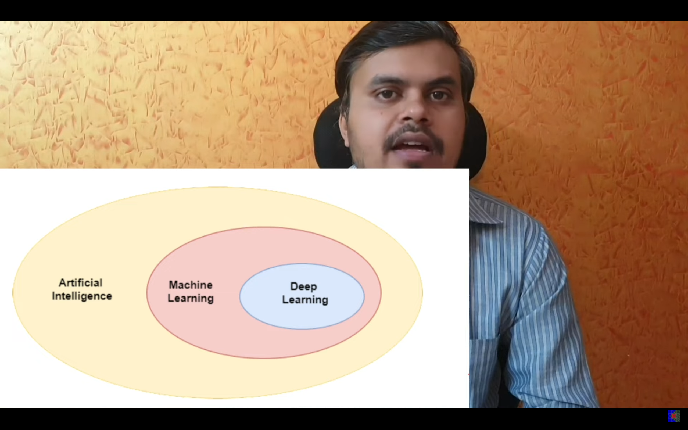
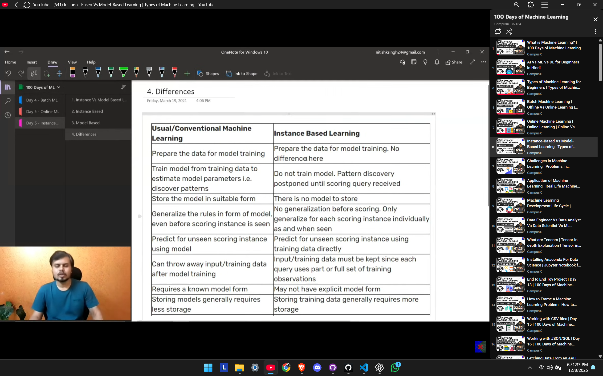

**Date:** 2025-12-08  
**Day:** Day 1  
**Topic:** What is Machine Learning?

**What I Learned Today:**

- Machine Learning is a subset of AI that enables computers to learn patterns from data.
- ML systems improve automatically through experience.
- Types of ML: Supervised, Unsupervised, Reinforcement Learning.
- Applications: recommendation systems, fraud detection, image recognition, NLP, etc.

**Key Insights:**  
Machine Learning is the foundation of modern AI systems. It enables data-driven predictions and decisions, forming the backbone of automation and intelligent applications.

### 📸 Screenshots

Click to view screenshots

