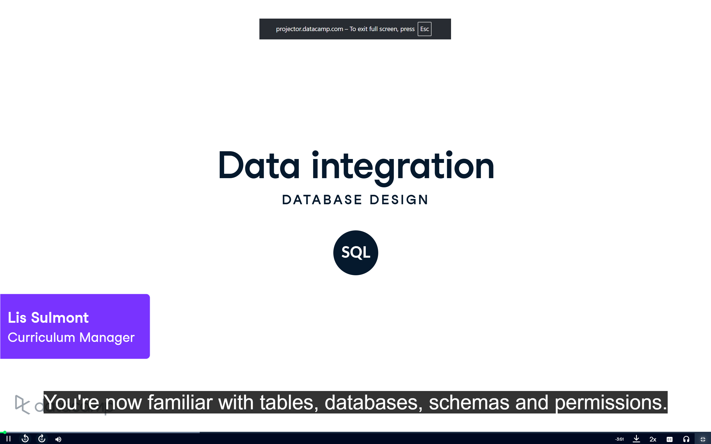
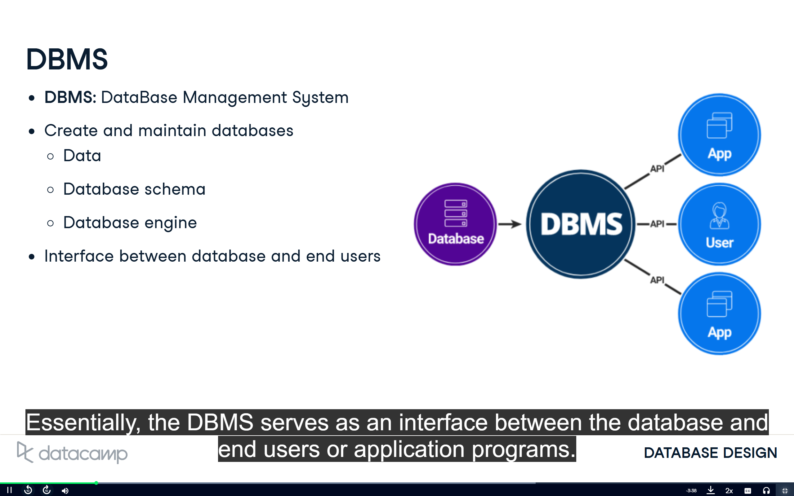

# MY AI/ML LEARNING JOURNEY

  
  

 

    

    

> [!note]
> I'll share progress and demos on **LinkedIn** and **Twitter**.
> Updates will be concise and focused on what I actually built or explored.

---

## Projects Completed

| Projects                                                                           | Description                                | Deployment                       |
| ---------------------------------------------------------------------------------- | ------------------------------------------ | -------------------------------- |
| [Project Name](https://github.com/pandeysulav/NEURONEXUS/tree/main/project-folder) | Brief description of what the project does | [Live Demo](https://example.com) |
| [Project Name](https://github.com/pandeysulav/NEURONEXUS/tree/main/project-folder) | Brief description here                     | [Live Demo](https://example.com) |

---

## Resources

| Books & Courses                           | Completion Status |
| ----------------------------------------- | ----------------- |
| Essence of Linear Algebra @3Blue1Brown    | ✅                 |
| Machine Learning Specialization @Coursera | ✅                 |
| ML Playlist @CampusX                      | ⏳                 |
| Hands-On Machine Learning (Sklearn & TF)  | ⏳                 |
| MIT Intro to Deep Learning                | ⏳                 |
| Deep Learning Playlist @CampusX           | ⏳                 |
| Neural Networks @3Blue1Brown              | ⏳                 |
| fastai Deep Learning                      | ⏳                 |
| Karpathy Zero to Hero                     | ⏳                 |
| LangChain Intro @Pinecone                 | ⏳                 |
| ML Resources Web                          | ⏳                 |
| GenAI Handbook                            | ⏳                 |
| HF Deep RL Course                         | ⏳                 |
| RLHF Book                                 | ⏳                 |

---

## Daily Progress Tracker

| Days             | Date       | Topics     | Resources |
| ---------------- | ---------- | ---------- | --------- |
| [Day 1](#day-01) | YYYY-MM-DD | Topic Here | [Link](#) |
| [Day 2](#day-02) | YYYY-MM-DD | Topic Here | [Link](#) |

---

## Daily Learning

### Day 1: Basics of Linear Algebra

**Date:** 2024-12-14
**Day:** Day 1
**Topic:** Basics of Linear Algebra

**What I Learned Today:**

* Scalars, vectors, matrices
* Linear combinations & span
* Determinants & invertibility
* Dot & cross product concepts

**Images/Diagrams:**

---

### Day 2: SQL Commands

**Date:** 2024-12-15
**Day:** Day 2
**Topic:** SQL Commands

**What I Learned Today:**

* CRUD operations
* WHERE, ORDER BY, GROUP BY
* JOINs
* Aggregations
* Subqueries

**Images/Diagrams:**
(Add SQL diagrams here)

---

    

