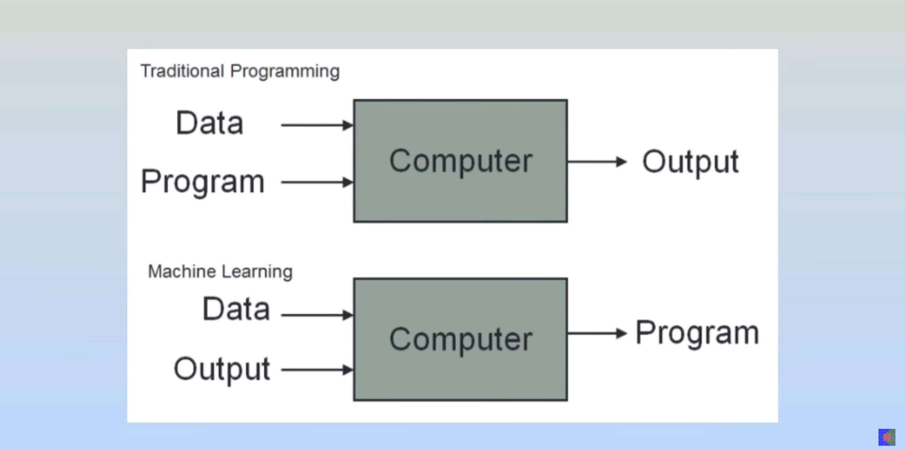
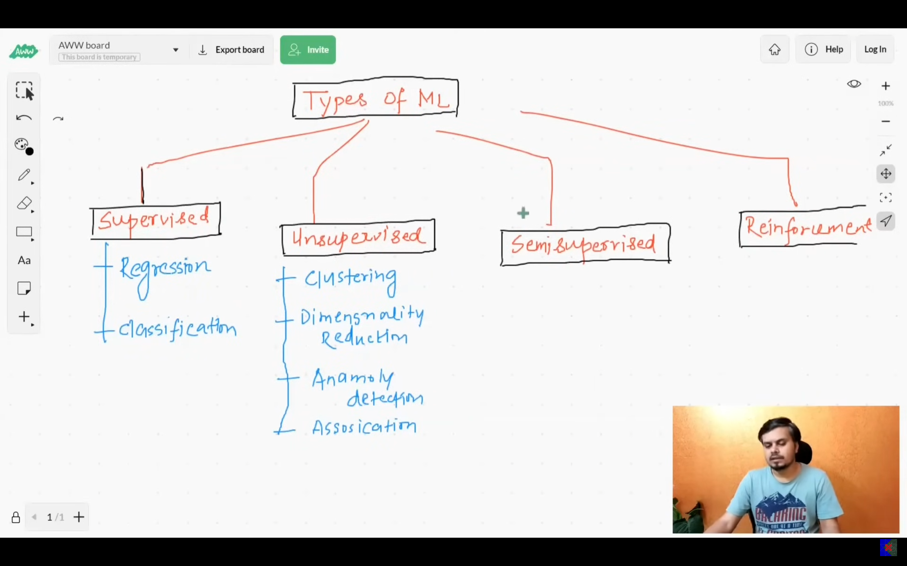
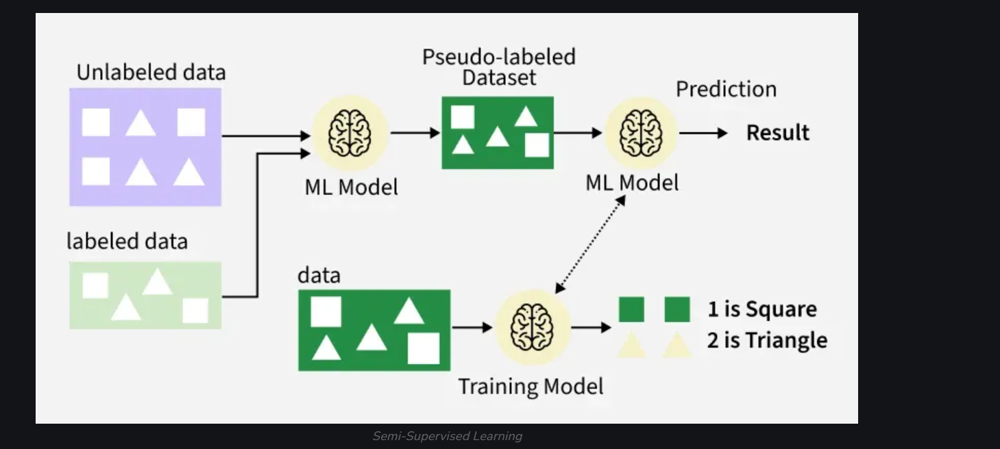
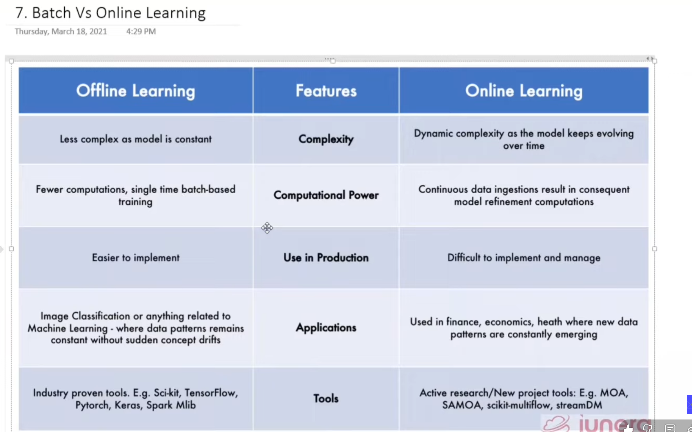
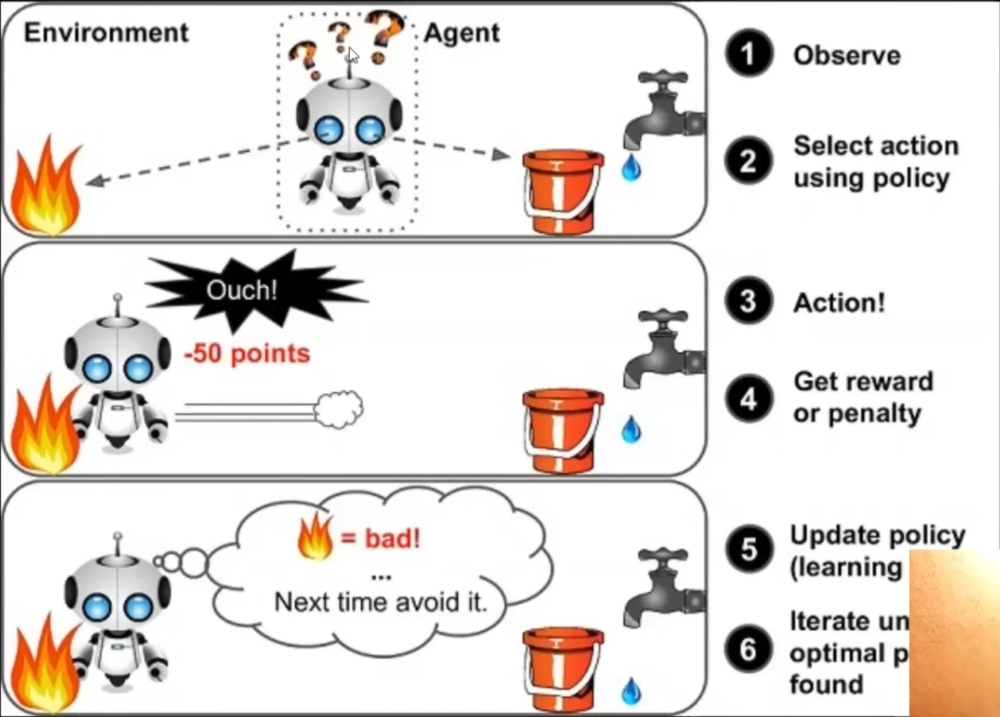

# MY AI/ML LEARNING JOURNEY

  
  

 

    

    

> [!note]
> I'll share progress and demos on **LinkedIn** and **Twitter**.  
> Updates will be concise and focused on what I actually built or explored.

---

## Projects Completed

| Projects                                                                           | Description                                | Deployment                       |
| ---------------------------------------------------------------------------------- | ------------------------------------------ | -------------------------------- |
| [Project Name](https://github.com/pandeysulav/NEURONEXUS/tree/main/project-folder) | Brief description of what the project does | [Live Demo](https://example.com) |
| [Project Name](https://github.com/pandeysulav/NEURONEXUS/tree/main/project-folder) | Brief description here                     | [Live Demo](https://example.com) |

---

## Resources

| Books & Courses                           | Completion Status |
| ----------------------------------------- | ----------------- |
| Essence of Linear Algebra @3Blue1Brown    | ✅                 |
| Machine Learning Specialization @Coursera | ✅                 |
| ML Playlist @CampusX                      | ⏳                 |
| Hands-On Machine Learning (Sklearn & TF)  | ⏳                 |
| MIT Intro to Deep Learning                | ⏳                 |
| Deep Learning Playlist @CampusX           | ⏳                 |
| Neural Networks @3Blue1Brown              | ⏳                 |
| fastai Deep Learning                      | ⏳                 |
| Karpathy Zero to Hero                     | ⏳                 |
| LangChain Intro @Pinecone                 | ⏳                 |
| ML Resources Web                          | ⏳                 |
| GenAI Handbook                            | ⏳                 |
| HF Deep RL Course                         | ⏳                 |
| RLHF Book                                 | ⏳                 |

---

## Daily Learning

---

### **Day 1: Introduction to Machine Learning**

**Date:** 2025-12-08  
**Day:** Day 1  
**Topic:** What is Machine Learning?

**What I Learned Today:**

- Machine Learning is a subset of AI that enables computers to learn patterns from data.
- ML systems improve automatically through experience.
- Types of ML: Supervised, Unsupervised, Reinforcement Learning.
- Applications: recommendation systems, fraud detection, image recognition, NLP, etc.

**Key Insights:**  
Machine Learning is the foundation of modern AI systems. It enables data-driven predictions and decisions, forming the backbone of automation and intelligent applications.

---

### **Day 2: Major Uses & Functions of NumPy and Pandas**

**Date:** 2025-12-09  
**Day:** Day 2  
**Topic:** NumPy & Pandas Essentials

### **NumPy Overview**

- Foundation of numerical computing in Python.
- Supports multidimensional arrays.
- Fast mathematical operations using vectorization.
- Tools for random numbers, linear algebra, broadcasting, reshaping.

### **Key NumPy Functions Learned:**

- `np.array()`
- `np.arange()`, `np.linspace()`
- `reshape()`
- Indexing & slicing
- `np.mean()`, `np.sum()`, `np.max()`
- `copy()` vs **views**

### **Pandas Overview**

- Best library for working with structured/tabular data.
- Provides **Series** (1D) and **DataFrames** (2D).
- Ideal for cleaning, wrangling, preprocessing.

### **Key Pandas Functions Learned:**

- `pd.Series()`, `pd.DataFrame()`
- `read_csv()`
- `.head()`, `.info()`, `.describe()`
- `.loc[]` and `.iloc[]`
- Handling missing values: `.isnull()`, `.fillna()`
- Filtering, grouping, merging

**Key Insights:**  
NumPy accelerates mathematical operations, while Pandas simplifies working with structured datasets — together forming the backbone of ML workflows.

---

### **Day 3: Seaborn, Matplotlib & Essential Pandas Visualization**

**Date:** 2025-12-10  
**Day:** Day 3  
**Topic:** Intro to Visualization (Matplotlib, Seaborn, Pandas)

**Resources Used Today:**  
- **CampusX Visualization Playlist:** https://youtu.be/3Xc3CA655Y4  
- **Krish Naik Visualization Tutorial:** https://youtu.be/0P7QnIQDBJY  

### **Matplotlib Basics**
- Foundation plotting library in Python.
- Learned:
  - `plt.plot()`, `plt.title()`, `plt.xlabel()`, `plt.ylabel()`, `plt.show()`
- Understood axes, figures, subplots.

### **Seaborn Overview**
- Built on top of Matplotlib.
- Provides beautiful and statistical plots.
- Learned:
  - `sns.countplot()`
  - `sns.barplot()`
  - `sns.histplot()`
  - `sns.pairplot()`
- Themes:
  - `sns.set_style("whitegrid")`

### **More Pandas Visualization**
- Pandas integrates directly with Matplotlib.
- Used `.plot()` for:
  - Line charts
  - Bar charts
  - Histograms
- Learned sorting & grouping for better visualization preparation.

**Key Insights:**  
Visualization helps understand distributions, relationships, and patterns — a crucial step before applying ML algorithms.

---

    

---

## Daily Progress Tracker

| Days  | Date       | Topics                               | Resources                                                                                                                        |
| ----- | ---------- | ------------------------------------ | -------------------------------------------------------------------------------------------------------------------------------- |
| Day 1 | 2025-12-08 | Intro to ML (Chapter 1–8)            | [CampusX – 100 Days of ML](https://youtu.be/ZftI2fEz0Fw)                                                                         |
| Day 2 | 2025-12-09 | NumPy & Pandas Basics                | [Krish Naik Machine Learning Playlist](https://youtube.com/playlist?list=PLZoTAELRMXVPBTrWtJkn3wWQxZkmTXGwe&si=J4ArLgWFJbz8tsWA) |
| Day 3 | 2025-12-10 | Matplotlib, Seaborn, Pandas Plotting | [CampusX Visualization](https://youtu.be/3Xc3CA655Y4) • [Krish Naik Visualization](https://youtu.be/0P7QnIQDBJY)                 |

---
